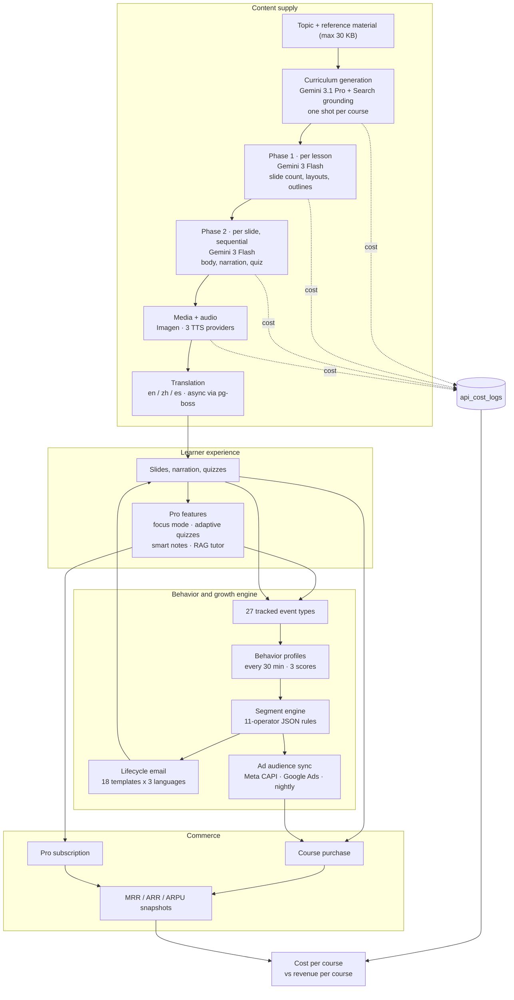

# Vocuz — an AI learning platform built as a closed loop

**[vocuz.ai](https://vocuz.ai)** · Product Manager & builder · 2026

Most course platforms are marketplaces: instructors supply the content, the platform takes a
cut. Vocuz inverts that. **The platform generates the courses.** Users buy them cheaply and
subscribe to Vocuz Pro to unlock the AI features on top — a commerce and subscription hybrid
where the marginal cost of inventory is an API bill rather than an instructor.

That only works if generated content is reliable enough to charge for, and if you know exactly
what each course costs to manufacture. Both are architecture problems.

Source code is private. This is the public write-up.

---

## The system



---

## Request lifecycle

Course generation is the load-bearing path. One request fans into roughly 1,500 model calls and
750 storage uploads, runs for ten to twenty minutes, and has to survive the user closing the tab.

```mermaid
sequenceDiagram
  participant U as Browser
  participant BFF as Express BFF
  participant D as Detached process
  participant G as Gemini
  participant Q as pg-boss
  participant DB as Supabase

  U->>BFF: POST /api/generate/content
  BFF->>DB: insert generation_jobs (running)
  BFF->>D: runLessonGenerationDetached()
  BFF-->>U: SSE stream opens
  Note over U,D: response returns immediately;<br/>work continues if the tab closes

  D->>G: Phase 1 — one call per lesson
  G-->>D: slide count, layouts, outlines
  D-->>U: SSE progress

  loop per slide, sequential
    D->>G: Phase 2 — body, narration, quiz
    G-->>D: slide content
    D-->>U: SSE progress
  end

  D->>Q: enqueue media, base-notes, quiz-pool
  D->>Q: enqueue translate-lesson per language
  D->>DB: write lesson_content + content_digest
  D-->>U: SSE done

  Q->>DB: workers write media, notes, quizzes, translations
  Note over Q,DB: orphan sweep fails jobs with<br/>no progress for 10 min
```

Progress is **both** streamed and polled, and the split is deliberate. SSE carries seven event
types — `job-assigned`, `job-started`, `progress`, `slide-ready`, `section-ready`, `complete`,
`error` — at per-slide resolution. A separate polled endpoint reads `generation_jobs`, which is
written at coarser granularity (every third slide, plus phase transitions). The client overlays
the stream on the poll: SSE gives resolution while the connection holds, the poll gives
durability when it does not. A network blip or a page refresh loses the stream, not the run.

---

## The generation pipeline

One course = one `courses` row + N `lessons` rows + per-language `lesson_content` rows. A lesson
is roughly 30 minutes, 18–30 slides.

**Two phases, not one call.** Phase 1 plans a lesson in a single call — slide count, per-slide
layout, titles, outlines, media prompts. Phase 2 writes each slide in its own call, sequentially,
so each slide sees what came before it.

Splitting them puts the structural decision in one place with the whole lesson in view, writes
each slide against a fixed brief, and makes failure granular: one bad slide is one retry rather
than a discarded lesson.

**Routing is by task, and the reason is cost.**

| Task | Model | Why |
|---|---|---|
| Curriculum generation | `gemini-3.1-pro` + Search grounding | One shot per course; reasons across all lessons at once; structured-output stability worth the price |
| Phase 1 structure | `gemini-3-flash` | Per lesson, single-lesson scope |
| Phase 2 per slide | `gemini-3-flash` | ~1,500 calls on a large course — the line item that decides margin |
| Remotion animation code | `gemini-3.1-pro` | Invalid generated React costs more to handle than the model does |
| Slide imagery | `gemini-3-pro-image` | — |
| Lesson digest | *none* | Pure string extraction from summary-slide narration — the model call here was deleted in April 2026 |

That last row is the pattern in miniature: the cheapest call is the one you remove.

---

## Course-level coherence

A 60-lesson course generated lesson-by-lesson reads like 60 essays by 60 authors: the same
example reintroduced twice, notation that drifts between lessons, lesson 40 explaining something
lesson 12 already taught. This was the hardest problem in the system and it is solved entirely
upstream.

### The curriculum is a contract, not a list of titles

Curriculum generation is one grounded call — `gemini-3.1-pro` with Google Search, roughly 10–15
searches — and it is forced through a function call. `toolConfig.functionCallingConfig` is set to
`mode: 'ANY'` with `allowedFunctionNames: ['emit_curriculum']`, so the model *cannot* answer in
free text. Every lesson comes back as:

```ts
interface GroundedLessonPlan {
  title: string;
  keyConcepts: string[];    // 3–5 specific concepts
  primaryExample: string;   // the running scenario for this lesson
  buildsOn: string[];       // natural-language references to earlier lessons
}
```

`primaryExample` and `buildsOn` are the coherence primitives. They are decided once, for the
whole course, by a model that can see every lesson at the same time — which is the only moment
in the pipeline where that global view exists.

**Length is pinned, not inferred.** Every course targets 50–60 lessons, a hard floor and a hard
ceiling, because pricing, completion arcs and the value model are all calibrated to that range.
The prompt carries explicit decomposition guidance in both directions: fewer than 50 means the
topic was over-compressed and major concepts should be split into natural sub-lessons ("Mean
Reversion" → theory, pairs-trading mechanics, cointegration testing, half-life estimation); more
than 60 means padding or over-granular splitting, so merge siblings.

An earlier design offered Focused / Standard / Comprehensive / Deep tiers. They were removed —
they produced topic-specific scope drift, where the same tier meant something different for
quant trading than for web development. A fixed range with decomposition rules turned out to be
more predictable than a knob.

**Difficulty selects topics; it does not change density.** Beginner allows 2–3 key concepts per
lesson with every concept explainable in two minutes and no untaught prerequisites; advanced
allows 3–5 with edge cases, tradeoffs and field-appropriate mathematics. The prompt anchors each
level to reference material a human would recognise — Codecademy and freeCodeCamp at one end,
MIT OpenCourseWare and graduate texts at the other — because "harder" is not an instruction a
model can act on but "pitch this like OCW" is.

**Bookends are mandatory and structurally different.** Lesson 1 is an opener with orientation
concepts (course goals, roadmap, prerequisites — never field jargon) and an empty `buildsOn`.
The final lesson is a wrap-up whose `buildsOn` points at the most significant concepts from the
middle of the course, so the synthesis is anchored in what was actually taught rather than
invented at the end.

### One prompt rule that got shorter and worked better

The curriculum prompt originally carried a ~50-line "scope honesty" block: a universal test,
worked examples across eight domains, title-pattern guardrails, an anti-reframing safeguard.
Its purpose was to stop the model proposing lessons Vocuz cannot deliver — slides and voiceover
cannot walk someone through deploying a service.

It backfired. Even with explicit whitelisted examples like *"Implementing the Sharpe Ratio in 10
lines of Python (annotated)"*, the surrounding framing pushed the model toward "play it safe,
show no code at all", and curricula came back with zero code-walkthrough lessons even for
domains that are mostly code.

It was collapsed to one rule: slides can show anything static — text, equations, diagrams,
charts, code. No project building; do not promise the student will build, deploy, set up,
connect to or configure anything. Ban the promise, do not prescribe the content, let the model
infer per domain. Shorter and stricter beat longer and hedged.

### Three channels carry context forward

Each lesson's Phase 1 receives, alongside its own title and description:

| Channel | Contents | Purpose |
|---|---|---|
| `curriculumPlan` | The **entire** course plan — order, title, `keyConcepts`, `primaryExample`, `buildsOn` for every lesson | This lesson knows what its siblings will cover, before and after |
| `priorLessonSummaries` | `content_digest` of each already-finalized lesson | This lesson knows what was actually said, not just what was planned |
| `allLessonTitles` + `currentLessonIndex` | Position in the sequence | Callbacks and forward references land on real neighbours |

Phase 2 then adds two more within the lesson: `lessonStructure` (every slide title) and
`priorNarrations` (narrations already finalized earlier in this same lesson), so slide 14 can
open on a callback to slide 9 without repeating it.

Plan and reality are deliberately separate inputs. The plan says what lesson 12 was *supposed*
to cover; the digest says what it *did*. Generation drifts, so building on the plan alone
reintroduces exactly the incoherence this is meant to prevent.

**But the digest channel is empty on the path that matters most.** Generating a whole course
fires every lesson in parallel — that is what turns 90 minutes of sequential work into 10–20
minutes of wall time. It also means no earlier lesson has finished writing its digest when a
later lesson's Phase 1 runs, so `priorLessonSummaries` arrives empty for every lesson in a batch.
The channel pays off on sequential generation, on regenerating a single lesson, and on lessons
added to an existing course — not on the first build.

That is a real tension, not an oversight: the parallelism that makes course generation tolerable
is exactly what starves the mechanism designed to make it coherent. Course-wide coherence in a
batch therefore rests entirely on the curriculum contract, which is why the contract is forced
through a function call and pinned to a fixed lesson range rather than left to prose.

`buildCurriculumBlock` degrades in three tiers — full enriched plan, titles only, nothing at all
— so courses created before the plan contract existed still regenerate instead of crashing on a
missing column.

### The repair pass that made things worse

There used to be a cohesion pass: one extra Flash call after Phase 2 that rewrote every slide
narration in a lesson for consistent notation, running examples and callbacks.

It was removed. It cost 5–8 seconds per lesson, and — the real problem — **it introduced its own
inconsistencies, rewriting a correct slide to match an incorrect neighbour.** A repair pass that
cannot tell which of two disagreeing slides is right will propagate errors as readily as it
fixes them.

What replaced it moved the same constraints upstream: a `notationTable` emitted by Phase 1 and
threaded into every Phase 2 call, plus `primaryExample` from the curriculum contract and
`priorNarrations` continuity hints. Consistency became a property of the input rather than the
output of a rewrite.

That is the generalisable lesson from this system: **when generated output is inconsistent, the
fix is almost always further upstream than it feels like it should be.** Adding a pass to clean
up after a model is the intuitive move, and it is usually the wrong one.

---

## Failure handling

Content that is 95% good is not a product when someone paid for it. Every failure mode has a
defined recovery and a defined user impact.

| Failure | Recovery | User impact |
|---|---|---|
| Phase 1 model error | 1 retry, 2 s delay | Generation aborts, job marked failed |
| Phase 2 unparseable JSON | Retry, then `fallbackPhase2` | Minimal slide built from the outline |
| Phase 2 schema invalid | Retry; accept partial if still invalid | Slide may have missing fields |
| Phase 2 empty `mathLines` | Demote `math` layout to `split-media`, synthesize an image prompt | Text + image instead of a blank whiteboard |
| Image generation failure | None | Grey placeholder on that slide |
| TTS failure | None inline | No audio; a "Bake Audio" retry button appears |
| Translation failure | pg-boss `retryLimit=2` | Slide skipped in that language only |
| Embedding failure | pg-boss `retryLimit=2` | AI Tutor RAG missing that lesson |
| Stale orphan job | `sweepOrphanedJobs(10)` | No progress for 10 min resets the job to failed |

**Retries are classified, not blanket.** `RATE_LIMIT` and `API_ERROR` retry with exponential
backoff; `PAYMENT_REQUIRED` and `NO_CONTENT` do not, because retrying those only burns wall
time. Image generation has its own policy: a rate limit retries once after ~45 s and then defers
to the orchestrator's circuit breaker, and a content-policy block retries once with a sanitized
prompt prefix.

**Truncation counts as failure.** An earlier version accepted `MAX_TOKENS` responses as partial
successes and silently shipped half-finished narration. Truncation now returns `success: false`,
which fires the caller's escalation path instead of quietly degrading.

**Context assembly degrades in tiers.** The Phase 1 curriculum block resolves Tier A (enriched
plan) → Tier B (titles only) → Tier C (no block), so lessons created before the plan contract
existed still regenerate instead of crashing on a missing column.

**Narration has three providers** behind one interface, so a TTS outage or a voice-quality
regression is a config change rather than an incident.

---

## Bugs worth remembering

Cross-lesson context is the part that breaks in ways nobody notices until a student does.

**An off-by-one shifted every cross-lesson reference in the course.** A single index error meant
Phase 2 narration citing "Lesson N" was always pointing one lesson away. It surfaced when a
lesson-3 slide said *"the random walk hypothesis discussed in lesson three"* — random walk was
lesson two's content. Every callback in every course was quietly wrong, and nothing in the
pipeline could detect it, because a confident wrong reference is indistinguishable from a
correct one to everything except a reader who knows the material.

**The model invented course structure that did not exist.** A lesson-1 narration announced a
"Phase 4: Execution & Cloud" that corresponded to no lesson in the curriculum — a plausible-
sounding roadmap synthesised from nothing. The fix was a rule in the curriculum preamble
forbidding fabricated phase labels in roadmap, recap and preview slides: those slides may only
name lessons that exist.

**Framing a word count as a ceiling caused systematic under-delivery.** The prompt said "at
most N words"; slides came back consistently short. Changing the framing to "aim for N" fixed
it without changing the number. The model treats a ceiling as a target to stay safely under.

**A schema change had to be applied in six places.** Adding the curriculum plan contract meant
three separate insert/update path pairs in the course routes, and missing one would have silently
dropped the plan on that path. All six were found in review — it is the kind of gap that a type
system does not catch when the paths were duplicated before the field existed.

---

## Known limitations

Written down because a case study without them is marketing.

- **No server-side resume.** `generation_jobs` records status but nothing auto-resumes; if the
  backend restarts mid-generation, in-flight lessons are lost and the orphan sweep marks them
  failed after ten minutes. The client can reconnect; the server cannot.
- **`buildsOn` references are natural-language strings, not foreign keys.** "the activation
  function from L14" is text. Renaming lesson 14 leaves a dangling reference that degrades
  quietly rather than failing loudly.
- **No adversarial QA pass.** Content quality rests on the model's own self-consistency. Nothing
  checks for broken LaTeX, circular definitions, or factual errors before a student sees them.
- **The digest only captures summary-slide narration.** A concept defined on slide 5 but not
  restated in the summary is invisible to later lessons.
- **Spanish is translated, not native.** Slide-generation prompts branch on Chinese versus
  everything-else, so Spanish-primary courses generate in English and translate — correct output,
  wasted tokens.
- **Courses created before the plan contract have no plan.** There is no backfill; they fall
  through to the titles-only tier until regenerated.

---

## Performance

Measured on a 25-slide lesson and a 30-lesson course.

| Stage | Wall time | Notes |
|---|---|---|
| Curriculum generation | 15–30 s | ~10–15 grounding searches |
| Phase 1 | 8–15 s | one call |
| Phase 2 | 75–125 s | 25 slides × 3–5 s, sequential |
| Media | 15–25 s | parallel |
| Audio | 30–60 s | 2 concurrent |
| **Per lesson** | **90–180 s** | |
| **Full course, 30 lessons** | **10–20 min** | dominated by the slowest lesson; all fire in parallel |
| Single-slide regeneration | 5–15 s | Phase 2 + media + translation fan-out |
| Translation | 20–40 s per language | async via pg-boss |

Peak provider load for a full course: ~34 RPM on Flash (2% of the 2,000 RPM ceiling), ~8 RPM on
Imagen (1.6% of 500), 2 concurrent TTS streams, ~750 storage uploads over ~15 minutes.

The headroom is the point. The bottleneck is sequential Phase 2 *within* a lesson, not provider
limits — so the lever that moves wall time is parallelising across lessons, and it is already
pulled. Buying more provider quota would do nothing.

---

## Job orchestration

Fifteen pg-boss workers. Nothing user-facing blocks on any of them.

| Worker | Queue | Schedule |
|---|---|---|
| media / video / render | `media-generation`, `video-generation`, `render-animation` | on demand |
| embedding | `embedding-generation` | on demand |
| notes / quiz | `generate-base-notes`, `smart-notes`, `quiz-pool` | on demand |
| translation | `translate-lesson`, `translate-course-meta` | on demand |
| reminder | `session-reminder` | `*/5 * * * *` |
| behavior profiles | `compute-profiles` | `*/30 * * * *` |
| segments | `evaluate-segments` | `20,50 * * * *` |
| lifecycle email | `send-emails` | `25,55 * * * *` |
| ad audience sync | `daily-sync` | `0 3 * * *` |
| weekly report | `weekly-report` | `0 9 * * 1` |
| MRR snapshot | `mrr-snapshot` | daily |

The segment and email cadences are offset by five minutes on purpose — segments evaluate at :20
and :50, email sends at :25 and :55 — so membership is always fresh when the send decides
eligibility. Getting that ordering wrong sends yesterday's segment today.

---

## Data model

Thirty tables across 75 migrations, all under row-level security. The shapes that carry weight:

- **Content is split by language, not duplicated per course.** `courses` → `lessons` →
  `lesson_content` keyed by language, so adding a locale is rows rather than a fork.
- **`feature_events`** is the append-only spine — 27 event types, buffered client-side (flush at
  10 events or 5 s) and aggregated on a schedule rather than read live.
- **`user_behavior_profiles`** materialises three scores per user out of 13 sources. Segments
  read the profile, never the raw events, so evaluating a segment is one indexed read instead of
  a scan.
- **`api_cost_logs`** and **`mrr_snapshots`** are deliberately parallel: one prices supply, the
  other prices demand, and the join between them is the margin.
- **`processed_stripe_events`** gives webhook idempotency; **`generation_jobs`** carries SSE
  resumption state.

---

## Unit economics as a subsystem

`cost-logger.ts` holds a pricing table per model — input and output rates for each text model,
per-image rates for Imagen, per-million-token rates for Cohere embeddings, per-thousand-search
rates for rerank, per-thousand-character rates for TTS. Every generation writes provider, model,
token counts and computed USD cost to `api_cost_logs`, tagged by feature.

Alongside it a nightly worker snapshots MRR, ARR, ARPU and the new / churned / expansion /
contraction components from `subscription_events`.

Together they answer the only question that matters for a platform that manufactures its own
inventory: **what one course costs to produce versus what it earns.** For a 60-lesson course —
roughly 1,400 slides, each wanting a text call, often an image, and narration audio, then
multiplied by three languages — the answer is dominated by speech synthesis and image
generation, not by the text model everyone assumes is the expensive part. The ledger made that a
measurement rather than an argument.

---

## The growth engine

Internal infrastructure, not a user-facing feature.

Twenty-seven client event types flush into `feature_events`. Every thirty minutes a worker
aggregates thirteen data sources into a per-user profile carrying engagement, conversion-intent
and churn-risk scores. A JSON rule engine with eleven operators evaluates segment membership
against those profiles. Membership drives lifecycle email across eighteen templates in three
languages with per-template cooldowns, and a nightly audience sync to Meta's Conversions API and
Google Ads so paid acquisition targets lookalikes of users who actually converted.

Recommendations score candidates across six weighted dimensions — semantic similarity from
Cohere embeddings (30%), category affinity (15%), difficulty fit (15%), engagement (15%),
knowledge gap (15%), purchase history (10%) — with an LLM pass writing the reason string shown
to the user.

Segment-specific discount codes appear in email copy and are redeemed in Stripe's promo field
rather than auto-applied, so redemption is itself a measurable intent signal.

---

## Scale

| | |
|---|---|
| API endpoints | 195 across 60 route modules |
| Backend services | 33 |
| Background workers | 15 |
| Database tables | 30, across 75 migrations |
| Tracked event types | 27 |
| Frontend | 236 components, 17 lazy-loaded pages |
| Code | ~47k lines backend, ~68k frontend |

---

## Stack

React + Vite + TypeScript + Tailwind · Express BFF on Railway · Supabase Postgres with RLS ·
Clerk auth (JWT verified against JWKS at the BFF) · pg-boss job queue · Gemini 3 Flash / 3.1 Pro
/ Imagen / Veo · Cohere `embed-v4.0` (1536d) and `rerank-v4.0-fast` for RAG · ElevenLabs, OpenAI
and Google Cloud TTS · Remotion · Stripe · Resend · Meta Conversions API and Google Ads

> **Source code is private.** Happy to walk through any part of it in an interview.
