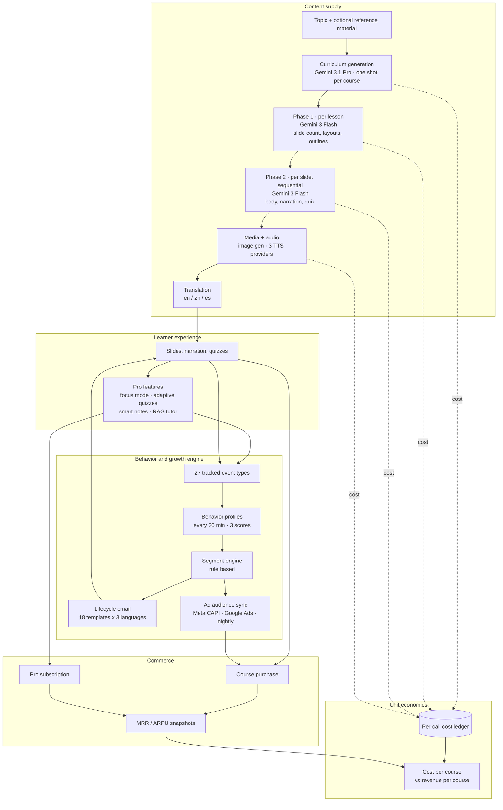

# Vocuz — an AI learning platform built as a closed loop

**[vocuz.ai](https://vocuz.ai)** · Product Manager & builder · 2026

Most course platforms are marketplaces: instructors supply the content, the platform takes a
cut. Vocuz inverts that. **The platform generates the courses.** Users buy them cheaply and
subscribe to Vocuz Pro to unlock the AI features on top — a commerce and subscription hybrid
where the marginal cost of inventory is an API bill rather than an instructor.

That inversion is only interesting if two things are true: the generated content has to be
good enough to charge for, and you have to know exactly what each course costs to produce.
Both are engineering problems disguised as product problems, and they drove most of the
decisions below.

Source code is private. This is the public write-up.

---

## The system

The loop is the point. Events feed profiles, profiles feed segments, segments feed both email
and paid-ad audiences, and those feed users back into content — while a parallel ledger prices
every generation call so the whole thing can be evaluated as a margin, not a vibe.

---

## The content pipeline, and why it is shaped that way

A course is one curriculum plus N lessons; each lesson is roughly 30 minutes of material,
18–30 slides. Generation runs in two phases.

**Phase 1 plans the lesson** — one call per lesson, producing slide count, per-slide layout,
titles, outlines and media prompts. **Phase 2 writes each slide** — one call per slide, run
sequentially, producing body content, narration script, quiz answers and comparison pairs.

**Decision: split planning from writing.** A single call asked to produce a whole 24-slide
lesson has to hold structure and prose in one context, and it degrades at both. Splitting
means the structural decision is made once with the whole lesson in view, and each slide is
then written against a fixed brief. It also makes failure granular — one bad slide is one
retry, not a discarded lesson.

**Decision: route by task, not by default.** Curriculum generation runs on the Pro model;
Phase 1 and Phase 2 run on Flash. The reasoning is economic. Curriculum generation happens
once per course and has to reason across every lesson at once, so structured-output stability
is worth the price. Phase 2 happens once per slide — on the order of a thousand-plus calls for
a large course — so it is the line item that decides whether the course is profitable.
Animation code generation goes back to Pro, because invalid generated React costs more to
handle than the model does.

**Decision: make sibling lessons aware of each other.** Lessons initially planned in isolation
and the results read like it — repeated examples, concepts introduced twice, no through-line.
Three mechanisms fixed it without a second pass over the whole course: the curriculum emits
key concepts, a primary example and a `buildsOn` link per lesson, persisted and visible to
Phase 1; each finalized lesson writes a digest that later lessons read; and each Phase 2 slide
call receives the lesson's full slide list plus the narrations already written before it.
Coherence became a property of the input, rather than a cleanup pass.

---

## What makes it shippable

Generated content that is 95% good is not a product when a customer paid for it. The pipeline
assumes failure rather than hoping against it.

**Errors are classified, not retried blindly.** Rate limits and transient API errors retry with
exponential backoff; exhausted credits and empty responses do not, because retrying those just
burns time. Truncated output is deliberately treated as a *failure* rather than a partial
success — an earlier version accepted truncated narration and silently shipped half-sentences,
so hitting the token ceiling now triggers the caller's escalation path instead.

**Layouts degrade instead of breaking.** If a slide is planned as a math layout but the writing
phase returns no equations, it is demoted to a media layout with a synthesized image prompt.
The learner sees a different slide; they never see a blank whiteboard.

**The curriculum context has three tiers.** Full enriched plan, titles only, or nothing —
so lessons generated before the plan contract existed still regenerate correctly instead of
crashing on a missing field.

**Narration has three voices behind it.** Three TTS providers sit behind one interface, so a
provider outage or a voice quality regression is a config change rather than an incident.

Generation is a detached process streaming progress over SSE, with fifteen background workers
handling media, video, rendering, embeddings, quiz pools, notes, translation and scheduled
jobs — so a user closing the tab does not kill a twenty-minute course build.

---

## Knowing what it costs

Every model call is priced at the moment it happens. A pricing table covers each text, image,
embedding, rerank and speech model, and every generation writes provider, model, token counts
and computed cost to a ledger. In parallel, a nightly job snapshots MRR, ARR, ARPU and the new,
churned, expansion and contraction components.

Put together, those two give the number that actually matters for a platform that manufactures
its own inventory: **what one course costs to produce versus what it earns.**

That instrumentation was not decoration. For a large course — sixty lessons at roughly
twenty-four slides each is on the order of 1,400 slides, each wanting a text call, often an
image, and narration audio, then multiplied again by translation into three languages — the
production cost is dominated not by the text model but by speech synthesis and image
generation. Having the ledger meant that was a measured fact rather than an argument.

---

## Growth as part of the product

The behavior engine is internal infrastructure, not a feature users see.

Twenty-seven event types are tracked from the client — course card clicks, page dwell, slide
views, searches, blocked Pro features, tutor opens — and buffered before flushing. Every
thirty minutes a worker aggregates them into a per-user behavior profile carrying three scores:
engagement, conversion intent, and churn risk. A rule engine evaluates segment membership
against those profiles, and segment membership drives two outputs: lifecycle email across
eighteen templates in three languages, with cooldowns so a user cannot be hit twice; and
nightly audience sync to Meta's Conversions API and Google Ads, so paid acquisition targets
people who resemble users who actually converted.

Discount codes tied to specific segments are surfaced in email copy and redeemed in Stripe's
promo field rather than auto-applied — deliberately, so that redemption is itself a measurable
signal of intent.

---

## Scale

| | |
|---|---|
| API endpoints | 195 across 60 route modules |
| Background workers | 15 (media, video, render, embeddings, notes, quiz, translation, profiling, segmentation, email, ad sync, reminders, reports) |
| Database tables | 30, across 75 migrations |
| Tracked event types | 27 |
| Languages | 3 (en / zh / es), auto-translated |
| Email templates | 18, localized |
| Frontend | 236 components, 17 lazy-loaded pages |
| Code | ~115,000 lines |

---

## Stack

React + Vite + TypeScript + Tailwind · Express BFF on Railway · Supabase Postgres with RLS ·
Clerk auth · pg-boss job queue · Gemini 3 Flash / 3.1 Pro / Imagen · Cohere embeddings and
rerank for RAG · ElevenLabs, OpenAI and Google Cloud TTS · Remotion for rendered animation ·
Stripe billing · Resend email · Meta Conversions API and Google Ads

> **Source code is private.** Happy to walk through any part of it in an interview.
